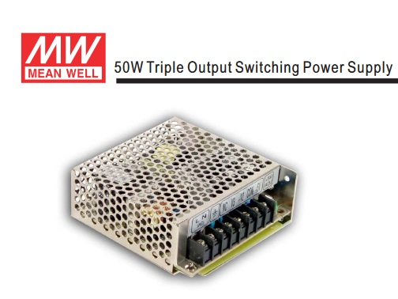
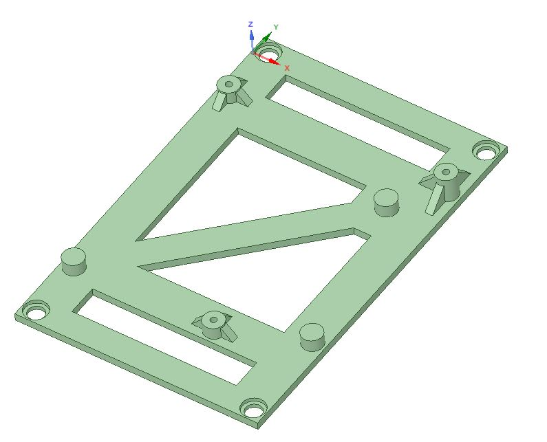

# Amiga Mean Well RT-50B PSU Mount
A 3d-printable PSU Mount for Mean Well RT-50B to fit inside an old Amiga PSU enclosure, two different versions

The 3d-models are created in DesignSpark Mechanical 4.0

These two brackets fit different versions of the A500 PSU Enclosure

### Version 1

### Version 2

Under construction...
