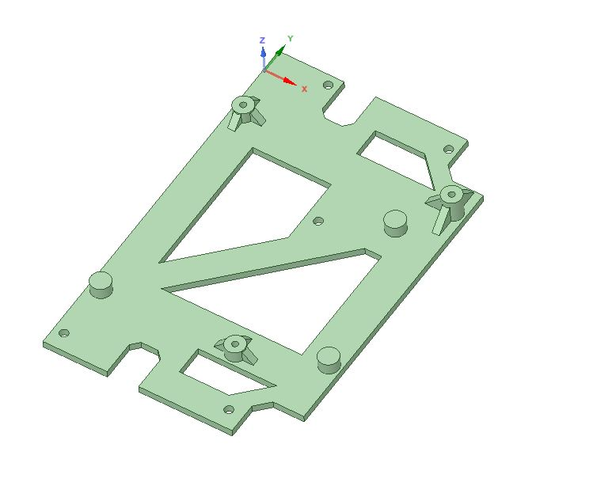

# Amiga Mean Well RT-50B PSU Mount
A 3d-printable PSU Mount for Mean Well RT-50B to fit inside an old Amiga PSU enclosure, two different versions

The 3d-models are created in DesignSpark Mechanical 4.0

These two brackets fit different versions of the A500 PSU Enclosure

### Version 1

Did this 3d-print in ABS filament 250°/120° (Nozzle/Bed). It took ~4 hours. As you can see it is a snug fit in this old type of PSU case. I had to sand off a little of the ventilation fins on the sides in order for the Mean Well to fit in the case.

### Version 2

Did this 3d-print in ABS filament 250°/120° (Nozzle/Bed). It took ~4 hours. 

Under construction...
